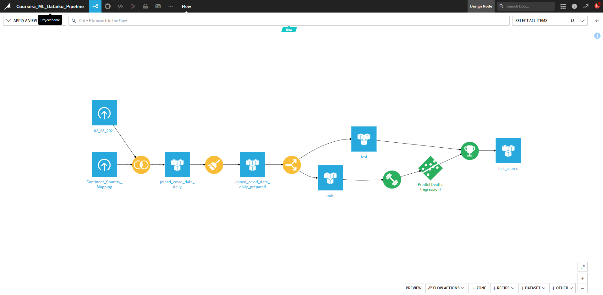

# Dataiku Coursera Project
I have completed a Prediction Project on Dataiku. The main purpose of the project is to predict the number of deaths in the US during COVID. From this what I've learned on Dataiku platform is:
1. How to create a project
2. How to import dataset into Dataiku project
3. How to Joins dataset
4. How to prepare the dataset based on what we want to analyze
5. How to split the model into Train and Test dataset.
6. How to train the model using Machine Learning algorithm.
7. How to find the score of the model on the test dataset.

All of this work have been done without coding to utilise the function of Visual Recipe inside Dataiku.

